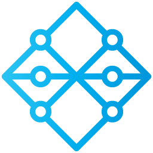
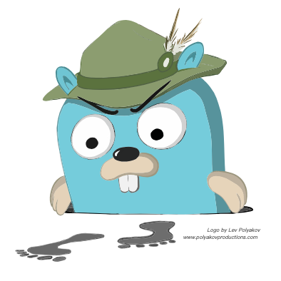

# goligoli

## 项目架构


### 调用关系


### 服务关系


### 服务介绍

| 目录      | 介绍             |
|---------|----------------|
| API     | 基于 Hertz 的网关服务 |
| User    | 用户信息           |
| Push    | 实时消息服务         |
| Message | 消息处理服务         |
| Live    | 直播间管理服务        |
| Lottery | 抽奖服务           |

### 项目特点
- 使用SSE(Server-Sent Events)实现实时消息推送，使用推模型减少消息推送延迟
- 实现流式弹幕推送限流器，在超大直播间中，保证弹幕推送的稳定性，提高用户体验
- 支持直播回放
- 使用NSQ实现消息队列，实现异步任务，减少请求时间，并实现流量削峰
- 使用Jaeger实现分布式追踪，监控和故障排查微服务架构中的请求链路
- 使用etcd实现配置共享和服务发现，提供可靠的数据存储和一致性保证
- 对象存储数据库存储直播间封面和直播回放，节省了服务器资源
- 使用微服务框架，实现功能解耦

### API文档
https://console-docs.apipost.cn/preview/3afa23205f8cddef/d92b80e31c14eea9

### 目录结构

```shell
.
├── LICENSE
├── README.md
├── deployment
│   └── opentelemetry
│       └── config.yaml
├── docker-compose.yaml
├── go.mod
├── go.sum
├── server
│   ├── common
│   │   ├── consts
│   │   │   ├── consts.go
│   │   │   └── errors.go
│   │   ├── middleware
│   │   │   └── jwt.go
│   │   └── tools
│   │       ├── jwt.go
│   │       ├── limiter.go
│   │       ├── limiter_test.go
│   │       ├── live.go
│   │       └── md5.go
│   ├── idl
│   │   ├── api.thrift
│   │   ├── base.thrift
│   │   ├── live.thrift
│   │   ├── lottery.thrift
│   │   ├── message.thrift
│   │   ├── push.thrift
│   │   └── user.thrift
│   ├── kitex_gen
│   │   ├── base
│   │   │   ├── base.go
│   │   │   ├── k-base.go
│   │   │   └── k-consts.go
│   │   ├── live
│   │   │   ├── k-consts.go
│   │   │   ├── k-live.go
│   │   │   ├── live.go
│   │   │   └── liveservice
│   │   │       ├── client.go
│   │   │       ├── invoker.go
│   │   │       ├── liveservice.go
│   │   │       └── server.go
│   │   ├── lottery
│   │   │   ├── k-consts.go
│   │   │   ├── k-lottery.go
│   │   │   ├── lottery.go
│   │   │   └── lotteryservice
│   │   │       ├── client.go
│   │   │       ├── invoker.go
│   │   │       ├── lotteryservice.go
│   │   │       └── server.go
│   │   ├── message
│   │   │   ├── k-consts.go
│   │   │   ├── k-message.go
│   │   │   ├── message.go
│   │   │   └── messageservice
│   │   │       ├── client.go
│   │   │       ├── invoker.go
│   │   │       ├── messageservice.go
│   │   │       └── server.go
│   │   ├── push
│   │   │   ├── k-consts.go
│   │   │   ├── k-push.go
│   │   │   ├── push.go
│   │   │   └── pushservice
│   │   │       ├── client.go
│   │   │       ├── invoker.go
│   │   │       ├── pushservice.go
│   │   │       └── server.go
│   │   └── user
│   │       ├── k-consts.go
│   │       ├── k-user.go
│   │       ├── user.go
│   │       └── userservice
│   │           ├── client.go
│   │           ├── invoker.go
│   │           ├── server.go
│   │           └── userservice.go
│   └── service
│       ├── api
│       │   ├── biz
│       │   │   ├── errno
│       │   │   │   └── errno.go
│       │   │   ├── global
│       │   │   │   └── global.go
│       │   │   ├── handler
│       │   │   │   ├── api
│       │   │   │   │   └── api_service.go
│       │   │   │   └── ping.go
│       │   │   ├── model
│       │   │   │   ├── api
│       │   │   │   │   └── api.go
│       │   │   │   └── base
│       │   │   │       └── base.go
│       │   │   └── router
│       │   │       ├── api
│       │   │       │   ├── api.go
│       │   │       │   └── middleware.go
│       │   │       └── register.go
│       │   ├── build.sh
│       │   ├── config
│       │   │   ├── config.go
│       │   │   └── global.go
│       │   ├── config.yaml
│       │   ├── etcd
│       │   │   ├── go.sum
│       │   │   └── kv.go
│       │   ├── initialize
│       │   │   ├── config.go
│       │   │   ├── etcd.go
│       │   │   └── rpc
│       │   │       ├── init.go
│       │   │       ├── live.go
│       │   │       ├── lottery.go
│       │   │       ├── message.go
│       │   │       ├── push.go
│       │   │       └── user.go
│       │   ├── main.go
│       │   ├── router.go
│       │   ├── router_gen.go
│       │   └── script
│       │       └── bootstrap.sh
│       ├── etcd.sh
│       ├── live
│       │   ├── build.sh
│       │   ├── config
│       │   │   ├── config.go
│       │   │   └── global.go
│       │   ├── config.yaml
│       │   ├── dao
│       │   │   └── mysql.go
│       │   ├── etcd
│       │   │   ├── go.sum
│       │   │   └── kv.go
│       │   ├── handler.go
│       │   ├── initialize
│       │   │   ├── config.go
│       │   │   ├── db.go
│       │   │   └── etcd.go
│       │   ├── kitex_info.yaml
│       │   ├── main.go
│       │   └── script
│       │       └── bootstrap.sh
│       ├── lottery
│       │   ├── build.sh
│       │   ├── config
│       │   │   ├── config.go
│       │   │   └── global.go
│       │   ├── config.yaml
│       │   ├── dao
│       │   │   ├── mysql.go
│       │   │   └── redis.go
│       │   ├── etcd
│       │   │   ├── go.sum
│       │   │   └── kv.go
│       │   ├── handler.go
│       │   ├── initialize
│       │   │   ├── config.go
│       │   │   ├── db.go
│       │   │   ├── etcd.go
│       │   │   └── nsq.go
│       │   ├── kitex_info.yaml
│       │   ├── main.go
│       │   ├── model
│       │   │   └── model.go
│       │   ├── mq
│       │   │   └── nsq.go
│       │   └── script
│       │       └── bootstrap.sh
│       ├── message
│       │   ├── build.sh
│       │   ├── config
│       │   │   ├── config.go
│       │   │   └── global.go
│       │   ├── config.yaml
│       │   ├── dao
│       │   │   └── mysql.go
│       │   ├── etcd
│       │   │   ├── go.sum
│       │   │   └── kv.go
│       │   ├── handler.go
│       │   ├── initialize
│       │   │   ├── config.go
│       │   │   ├── db.go
│       │   │   ├── etcd.go
│       │   │   └── rpc
│       │   │       ├── init.go
│       │   │       └── live.go
│       │   ├── kitex_info.yaml
│       │   ├── main.go
│       │   ├── model
│       │   │   └── model.go
│       │   └── script
│       │       └── bootstrap.sh
│       ├── push
│       │   ├── build.sh
│       │   ├── config
│       │   │   ├── config.go
│       │   │   └── global.go
│       │   ├── config.yaml
│       │   ├── etcd
│       │   │   ├── go.sum
│       │   │   └── kv.go
│       │   ├── handler.go
│       │   ├── initialize
│       │   │   ├── config.go
│       │   │   ├── etcd.go
│       │   │   ├── nsq.go
│       │   │   └── rpc
│       │   │       ├── init.go
│       │   │       ├── live.go
│       │   │       └── message.go
│       │   ├── kitex_info.yaml
│       │   ├── main.go
│       │   ├── mq
│       │   │   └── nsq.go
│       │   └── script
│       │       └── bootstrap.sh
│       └── user
│           ├── build.sh
│           ├── config
│           │   ├── config.go
│           │   └── global.go
│           ├── config.yaml
│           ├── dao
│           │   └── mysql.go
│           ├── etcd
│           │   ├── go.sum
│           │   └── kv.go
│           ├── handler.go
│           ├── initialize
│           │   ├── config.go
│           │   ├── db.go
│           │   └── etcd.go
│           ├── kitex_info.yaml
│           ├── main.go
│           ├── model
│           │   └── model.go
│           └── script
│               └── bootstrap.sh
└── static
    └── images
        ├── call_relation.svg
        └── service_relations.svg
```

## 技术栈

### MySQL
MySQL 是一种广泛使用的关系型数据库管理系统，主要用于存储结构化数据，支持复杂查询和事务处理。


### Redis
Redis 用于缓存数据，提升服务承载能力。


### NSQ
NSQ 是一个实时分布式消息队列系统，实现异步任务，减少请求时间，并实现流量削峰。



### Jaeger
Jaeger 是一个开源的分布式追踪系统，监控和故障排查微服务架构中的请求链路。



### etcd
etcd 是一个分布式键值存储，用于配置共享和服务发现，提供可靠的数据存储和一致性保证，使用配置中心对配置文件进行统一管理。


